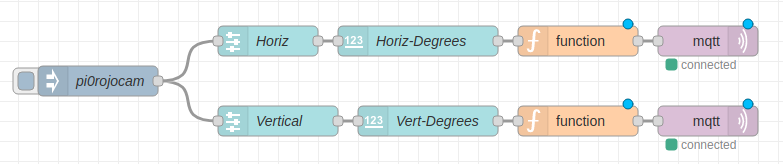
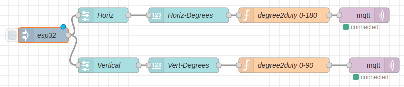

<link rel="stylesheet" href="./images/sj4u.css"></link>

# [STEM Just 4 U Home Page](https://stemjust4u.com/)
## This project connects a small SG90 servo with both the esp32 and a Pi0 

The Pi0 setup will include a PCA9685 16-Channel 12-bit PWM Servo Driver and I2C interface. The esp32 will use its built-in PWM to control the servo. It's possible to use the Pi0's PWM pins to control the servo but there will likely be significant jitter. I had to use the PCA9685 servo driver on the Pi0 setup to make it useable. To communicate instructions, servo angle, to the Pi0/esp32 we will use mqtt/node-red.

[Link to MQTT Project Web Site](https://stemjust4u.com/ServoKitPCA9685)  

## Materials 
* SG90 servo
* PCA9685 servo driver (only needed for the Pi0 setup)
* Raspberry Pi and/or esp32
* Optional - brackets to hold the servo
* Optional - servo tester (gives you confidence the servo is functional when trouble shooting your code)
​​
### Pi0/PCA9685 Software Requirements​
In raspi-config make sure i2c is enabled (in the interface menu)  
`$ sudo apt install python-smbus`  
`$ sudo apt install i2c-tools`  
Once the PCA9685 is connected you can confirm the address is 0x40 (assuming address has not been changed) at port 1 with i2cdetect command (searches /dev/i2c-1)  
`$ sudo i2cdetect -y 1`  
​Python packages are in requirements on github and include: setuptools, adafruit-blinka, adafruit-circuitpython-servokit, paho-mqtt

>Servos are low-speed, high-torque motors. Most standard servos have a limited rotation, for example 90, 180 or 270 degrees (continuous servos can rotate a complete 360). Servos are useful for positioning a device like a camera or solar panel. The SG90 I'm working with has a range of ~180 degrees. This needs to be taken into consideration in your node-red dashboard so you don't try and move the servo outside its range.

### Some specs on the SG90
* Weight: 9 g
* Dimension: 22.2 x 11.8 x 31 mm approx.
* Stall torque: 1.8 kgf·cm (x 13.88 for oz-in)
* Operating speed: 0.1 s/60 degree
* Operating voltage: 4.8 V (~5V)

>Torque is a measure of how much force the servo arm can apply at a distance from the servo shaft. So 13.88 oz-in of torque translates to a little under a 1lb of force 1in from the shaft. (or 7oz of force 2in from the shaft, etc)

Power usage
* I saw spikes of 2-2.5W when the servo was turning a long distance. For normal stepping movement it used 0.5W. While idle it was less than 0.05Watts 

# Servo Control with PWM

The SG90 will have 3 connections
1. Vcc (5V) - usually red -  **Use a separate power supply for the servo**
2. GND - usually brown/black - **Make sure the ground of the servo, power supply, Pi/esp32 are connected or common.**
3. PWM signal (50Hz) control - usually white, yellow, or orange.

The pulsewidth of the PWM signal is what controls the position of the servo arm.
50Hz or 1/50 = 20ms (0.02 seconds). To change the position of the servo arm you change the duty cycle.
The SG90 has an operating range of 1-2ms duty cycle.
* ~1 ms pulse is all the way to the left (-90 degrees)
* 1.5 ms pulse is neutral position (0 degrees)
* ~2 ms pulse is all the way to the right (+90 degrees)

The Pi0/PCA9685/SG90 using Adafruit_ServoKit takes the servo input in angles from 0 to 180. This makes the node-red dashboard controller easy to set up (output 0 to 180)
The esp32 takes the servo input in duty cycle. For the node-red dashboard I use a javascript node to convert between angle and duty cycle. So the user interface is in angles but the value sent to the esp32 is duty cycle.

To convert between pulse width and duty cycle use these formulas
* Duty Cycle = PulseWidth/Period
* Period = 1/frequency  

For the esp32 servo.duty(duty) and a 20ms period
* duty = PulseWidth*frequency
* 1ms pulse (-90 degrees): duty = 1*50 = 50 (or 1/20 =  5% DutyCycle)
* 1.5ms pulse (0 degrees): duty = 1.5*50 = 75 (or 1.5/20 = 7.5% DutyCycle)
* 2ms pulse (+90 degrees): duty = 2*50 = 100 (or 2/20 = or 10% DutyCycle)

Duty (50-100) to degrees (0-180) conversion  
`degrees =  180* ((duty - 50) / 50)`

Degrees (0-180) to duty (50-100) conversion  
`duty = 50 + (50 * (degrees / 180)`

You will need to do some trail-and-error with your specific servo and what range it has. There can be error in the potentiometer sensor used for positioning the servo shaft. 

>A servo tester is a stand-alone unit to test the functionality of a servo. If you are having problems getting any response from the servo in your code you can use a tester to confirm the servo itself is not the problem. The only input required is a 5V source. The tester provides the PWM signal. It has an auto, manual (with a knob), and neutral mode. You can also hook up multiple servos at once.

## Connecting the Servo to PCA9685​
The PCA9685 was powered by a 5V li-ion battery and the SG90 cable was connected to the Vcc/GND/PWM header.

## Connecting the PCA9685 to the Pi0.  
The PCA9685 uses the I2C interface. 
* Vcc=5V
* GRND=GRND
* SDA=GPIO2
* SCL=GPIO3

# Connecting SG90 directly to esp32 PWM
* A 5V li-ion power bank was used to power the SG90.
* The ground was connected to both the SG90 and esp32.
* I then used esp32 pins 4 and 5 for the PWM signal to control the two SG90 servos.  

You load the upython scripts /main.py, /boot.py, /umqttsimply.py on to the esp32.  [Directions using Thonny](https://stemjust4u.com/esp32-esp8266)

### MQTT Explorer  
MQTT Explorer is a great tool for watching messages between your clients and broker. You can also manually enter a topic and send a msg to test your code. This is useful for first setting up your code and trouble shooting.

# Code
​​PCA9685 servo driver with adafruit-circuitpython-servokit requires adafruit-blinka.  
Some additional functions to test your servo on the PCA9685.  
On my SG90 the range was 0- 180 degrees but your servo may differ. 
* You can change the total angle by setting actuation_range.
* kit.servo[0].actuation_range = 175
* If the servo doesn't sweep the full expected range try adjusting the minimum and maximum pulse widths.
* To set the pulse width range to a minimum of 1000 and a maximum of 2000: kit.servo[0].set_pulse_width_range(1000, 2000)

Code can be downloaded from github
$ git clone https://github.com/stemjust4u/ServoKitPCA9685​

Pi0(PCA9685)
/pi0adaServoMQTT-forever.py (uses the mqtt loop_forever)
/pi0adaServoMQTT-start.py (uses the mqtt loop_start)

esp32
/upython/main.py (and boot, umqttsimple files)

# Node Red
[Link to MQTT-Node-Red Setup](https://stemjust4u.com/mqtt-influxdb-nodered-grafana)  

The esp32 takes a duty value for input so a degree-to-duty conversion is made before publishing.

The node-red flows can be found at the bottom of the project web site and imported 
[Link to MQTT Project Web Site](https://stemjust4u.com/ServoKitPCA9685) 